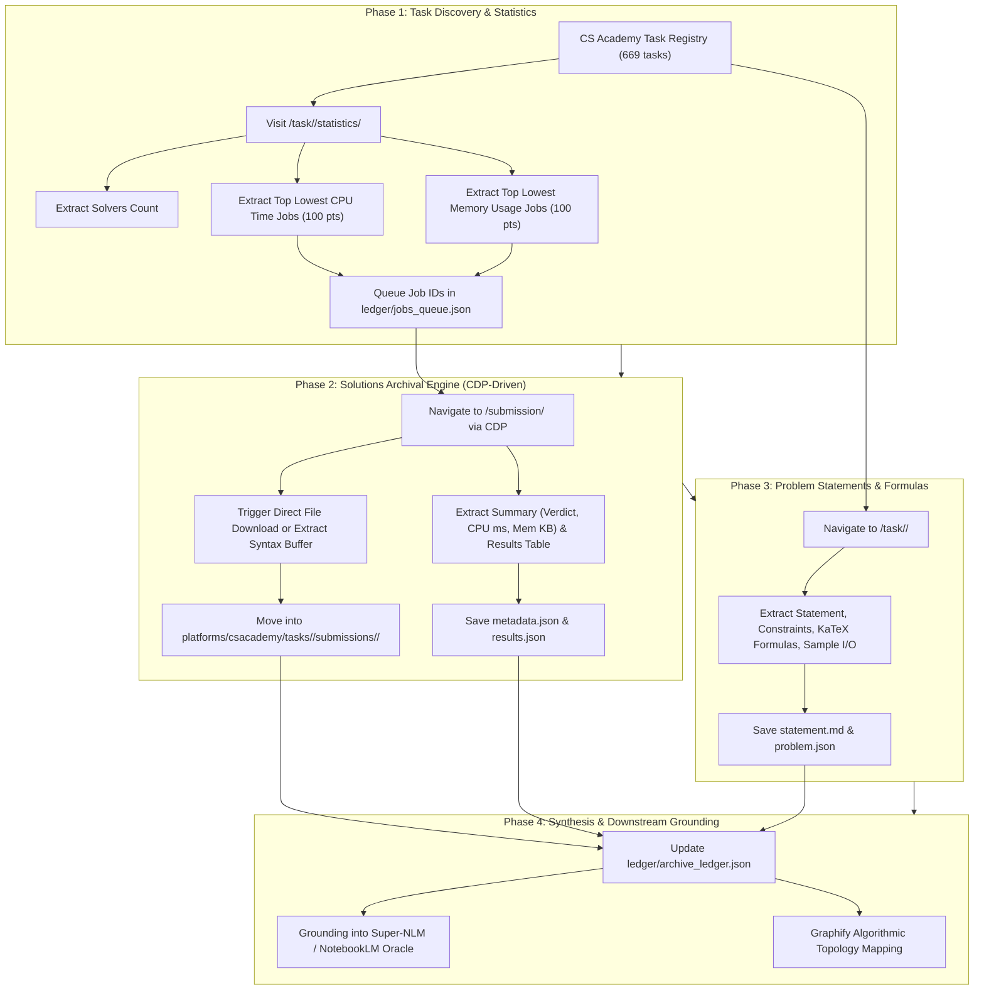

# IEEE PreXtreme & Competitive Programming Archival Blueprint & Handover Spec

**ID:** `SPEC-CP-ARCHIVE-001`  
**Date:** 2026-09-27  
**Status:** In Progress / Harvester Operational (Batch 1 Complete)  
**Authors:** Aaradhya Dev Tamrakar, Antigravity Agent  
**Target Repository:** `F:\Aaradhya-Dev-Tamrakar\IEEE-Xtreme-Archive`  
**Remote Origin:** [https://github.com/Aaradhya-Dev-Tamrakar/IEEE-Xtreme-Archive](https://github.com/Aaradhya-Dev-Tamrakar/IEEE-Xtreme-Archive)  
**Live Progress:** 669 tasks cataloged, 5 tasks fully harvested, 97 optimal 100-pt solutions archived.

---

## 1. Executive Summary & Objective

Build and execute an autonomous, high-throughput competitive programming (CP) problem-and-solution archival engine. The system leverages **Chrome DevTools Protocol (CDP)** attached to an active Chrome profile (`Profile 6`) to bypass Single Page Application (SPA) / WebSocket client-side rendering restrictions, archiving:
1. **Questions & Problem Statements:** Full Markdown text with KaTeX mathematical formulas, time/memory limits, constraints, subtasks, and sample I/O.
2. **Optimal 100-Point Solutions:** Directly retrieved via the **Statistics** leaderboard (`/contest/archive/task/<slug>/statistics/`), capturing both lowest CPU time and lowest memory solutions.
3. **Execution Metadata & Test Case Matrices:** Summary points, runtime, memory, compiler output, and granular per-test-case verdicts.

All harvested data is permanently cataloged in the dedicated standalone repository `F:\Aaradhya-Dev-Tamrakar\IEEE-Xtreme-Archive` for downstream ingestion into **Super-NLM / NotebookLM** and **Graphify** knowledge graphs.

---

## 2. Platform Architecture & Grounded Specifications

### 2.1 Judge Runtime Environment (`platforms/csacademy/evaluation_environment.json`)
* **Host Operating System:** x64 Ubuntu 25.04
* **C++ Compiler:** `g++ 15.2.0` (`-std=c++23 -static -O2 -pthread -Wall -Wno-unused-result -DCS_ACADEMY -DONLINE_JUDGE`)
  * Available Libraries: Boost 1.90, Eigen 3.4.0 (`<Eigen/Dense>`), AtCoder AC Library (`<atcoder/all>`), GMP 6.3.0, MPFR 4.2.2, zlib, bzip2, liblzma, zstd.
* **Python Environments:**
  * Python 3.13.3 (includes `numpy` and `scipy`)
  * PyPy3: Python 3.11.11, PyPy 7.9.13
* **Java:** OpenJDK 21 (`-XX:+UseSerialGC -Xmx4g -Xss256m -DONLINE_JUDGE -DCS_ACADEMY Main`)
* **Execution Constraints:** Multithreading enabled; total CPU time is aggregate across all threads.

### 2.2 Direct Download Configuration
* **Configured Download Folder:** `C:\Users\Aaradhya\Downloads\IEEE-Xtreme`
* **Download Settings:** *"Ask where to save each file before downloading"* is **disabled** (zero-popup direct writes).

---

## 3. End-to-End Archival Task Flow



---

## 4. Corpus Storage Schema

```text
F:\Aaradhya-Dev-Tamrakar\IEEE-Xtreme-Archive/
├── .gitignore
├── README.md
├── ARCHIVAL_PLAN_AND_HANDOVER.md       # This comprehensive guide
├── harvesters/
│   ├── cdp_engine.py                    # Lightweight WebSocket CDP client
│   └── csacademy_harvester.py           # Main extraction pipeline runner
├── ledger/
│   ├── tasks_index.json                 # Master list of all 669 discovered tasks
│   ├── jobs_queue.json                  # Pending submission job IDs to ingest
│   └── archive_ledger.json              # Checkpointed completed tasks & jobs
└── platforms/
    └── csacademy/
        ├── evaluation_environment.json  # Judge runtime specifications
        └── tasks/
            └── <task_slug>/             # e.g., tale, addition, gcd, contained-intervals
                ├── problem.json         # Limits, score type, constraints
                ├── statement.md         # Full Markdown problem statement with KaTeX math
                ├── statistics.json      # Solver count, lowest CPU, lowest memory
                └── submissions/
                    ├── index.json       # Registry of archived optimal solutions
                    └── <job_id>/        # e.g., 1167589
                        ├── metadata.json# User (e.g. fanache99), verdict, runtime, memory
                        ├── solution.<ext> # Clean un-truncated source code (cpp, py, java)
                        └── results.json # Granular per-test-case verification table
```

---

## 5. Execution Instructions & CLI Options

The harvester is driven by [`harvesters/csacademy_harvester.py`](harvesters/csacademy_harvester.py) via Chrome DevTools Protocol:

### Step 1: Launch Chrome with Remote Debugging
```powershell
Start-Process "C:\Program Files\Google\Chrome\Application\chrome.exe" -ArgumentList @(
    "--remote-debugging-port=9222",
    '--profile-directory=Profile 6',
    "--restore-last-session"
)
```
*(Note: Inner single quotes `'--profile-directory=Profile 6'` prevent PowerShell from splitting on the space and attempting to open `http://0.0.0.6`)*

### Step 2: Harvester CLI Commands
* **Run Discovery:** `python harvesters/csacademy_harvester.py --discover`
* **Single Task Run:** `python harvesters/csacademy_harvester.py --slug <task_slug>`
* **Batch Run:** `python harvesters/csacademy_harvester.py --max-tasks <N>`
* **Full Autonomous Run:** `python harvesters/csacademy_harvester.py`

---

## 6. Execution Milestones & Proven Results

| Date | Milestone | Scope | Results | Commit |
| :--- | :--- | :--- | :--- | :--- |
| **2026-09-27** | Handover Spec & Architecture | Architectural Design | Master blueprint & evaluation runtime spec committed | `55664e3` |
| **2026-09-27** | CDP Engine & Harvester Engine | Implementation | `cdp_engine.py` & `csacademy_harvester.py` operational | `8237539` |
| **2026-09-27** | Master Catalog Discovery | Phase 1 (All Tasks) | 669 tasks cataloged with difficulty, ratio, contest info | `8237539` |
| **2026-09-27** | Batch 1 Harvesting | 5 tasks, 97 solutions | 100% success rate: statements, math, code, test matrices | `8237539` |
| **2026-09-27** | Dedicated Skill & Metadata Enrichment | Skill Definition | Created `cp-archive-harvester` skill globally & in-repo, enriched metadata | *(Pending commit)* |

